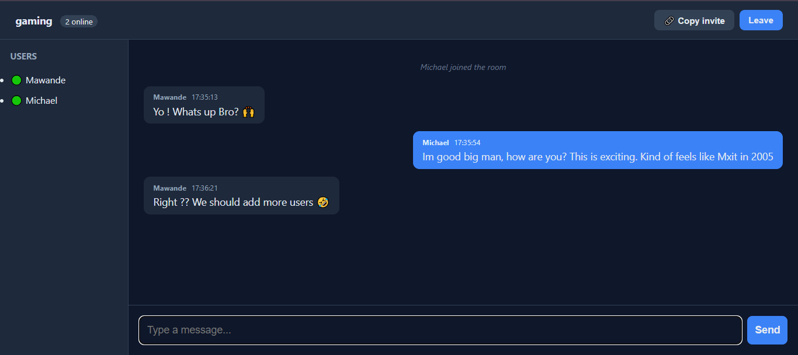

# 💬 chatByte

A lightweight, real-time chat application built with **Node.js**, **Express**, and **Socket.io**.
Join a room, pick a username, and chat instantly — no signup, no database, no friction.

🔗 **Live Demo:** [chatbyte-mjrv.onrender.com](https://chatbyte-mjrv.onrender.com/)


<p align="center">
  
</p>

---

## ✨ Features

- ⚡ **Real-time messaging** over WebSockets (Socket.io)
- 🏠 **Multiple chat rooms** — join any room by name
- 🔗 **Shareable invite links** — copy a URL and friends land in the same room
- 👥 **Live user list** showing who's online in the room
- ⌨️ **Typing indicators** so you know when someone's responding
- 🕒 **Timestamps** on every message
- 🎨 **Clean dark UI** — vanilla JS & CSS, no frameworks
- 🔒 **XSS-safe** message rendering

---

## 🚀 Quick Start

```bash
# 1. Clone the repo
git clone https://github.com/MawandeM-98/chatByte.git
cd chatByte

# 2. Install dependencies
npm install

# 3. Start the server
npm run dev

# 4. Open http://localhost:3000 in two browser tabs and start chatting!
```

> 💡 Open a second tab in **incognito** (or a different browser) to simulate a second user.

---

## 🛠️ Tech Stack

| Layer     | Tech                   |
|-----------|------------------------|
| Backend   | Node.js, Express       |
| Realtime  | Socket.io (WebSockets) |
| Frontend  | Vanilla HTML, CSS, JS  |
| Dev Tools | Nodemon                |
| Hosting   | Render                 |

---

## 📁 Project Structure

```
chatByte/
├── public/
│   ├── index.html      # UI markup
│   ├── style.css       # Dark theme styling
│   └── chat.js         # Client-side Socket.io logic
├── server.js           # Express + Socket.io server
├── package.json
├── package-lock.json
├── .gitignore
├── README.md
└── screenshot.png
```

> Note: `node_modules/` is generated by `npm install` and is **not** committed.

---

## 🧠 How It Works

1. The client connects to the server via Socket.io.
2. When a user joins, they emit a `joinRoom` event with a username and room name.
3. The server broadcasts a system message and updates the room's user list.
4. Messages are sent with `chatMessage` and rebroadcast to everyone in the room.
5. Typing events are throttled client-side and relayed to other users.
6. On disconnect, the user is removed and the room is updated live.

### Socket Events

| Event          | Direction       | Payload                        | Purpose                       |
|----------------|-----------------|--------------------------------|-------------------------------|
| `joinRoom`     | client → server | `{ username, room }`           | Join a room                   |
| `chatMessage`  | client → server | `{ text }`                     | Send a message                |
| `typing`       | client → server | `boolean`                      | Notify typing state           |
| `message`      | server → client | `{ user, text, time, system }` | Receive a message             |
| `userTyping`   | server → client | `{ username, isTyping }`       | Show "X is typing..."         |
| `userList`     | server → client | `string[]`                     | Updated list of users in room |

---

## 📜 Available Scripts

| Command       | Description                     |
|---------------|---------------------------------|
| `npm start`   | Run the server with Node        |
| `npm run dev` | Run with Nodemon (auto-restart) |

---

## 🗺️ Roadmap

- [ ] Persist message history (MongoDB)
- [ ] Private direct messages
- [ ] User authentication
- [ ] Image & file sharing
- [ ] Read receipts
- [x] Deploy to production (Render)

---

## 🤝 Contributing

Pull requests are welcome. For major changes, please open an issue first to discuss
what you'd like to change.

---

## 📄 License

MIT — free to use, modify, and share.